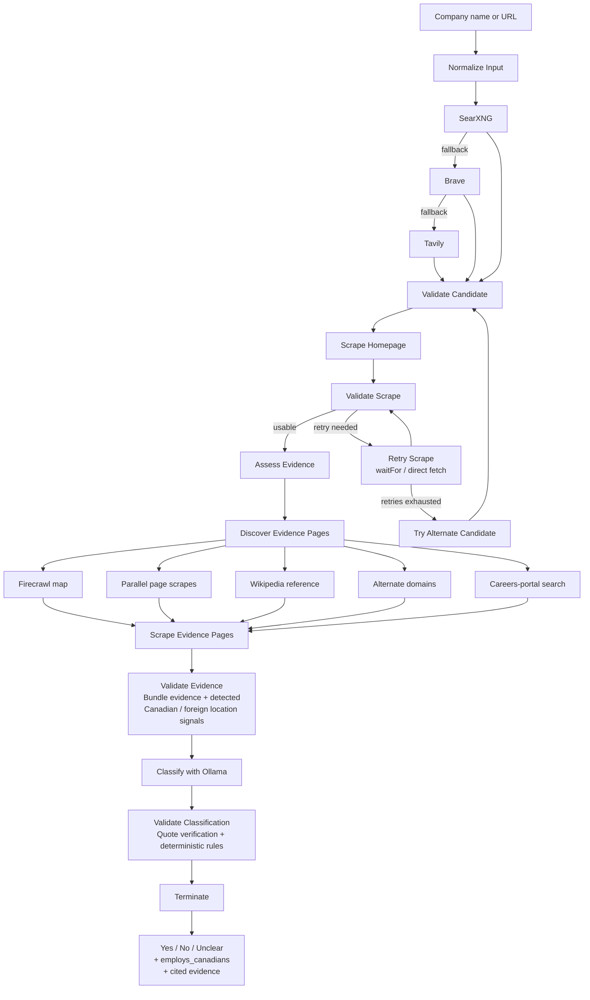

# Is It Canadian?

An evidence-driven checker that vets whether a company is Canadian, powered by an
agentic AI workflow built on LangGraph. Enter a **company name** or paste a
**URL** — the agent finds the official website, scrapes the homepage and
corporate pages, then asks a local Ollama model to classify the company strictly
from the collected evidence. Every answer is verified by deterministic rules:
no evidence, no verdict.

Results stream back to a React UI in real time as the agent runs.

## Demo

<a href="https://canadian.davidrintoul.info">
  
</a>

**[Try the live demo](https://canadian.davidrintoul.info)**

## What it does

- **Company name → website lookup** — SearXNG first, then Brave Search API, then
  Tavily Search API.
- **Candidate validation** — Ranks results by name-match score; rejects
  aggregators (Wikipedia, LinkedIn, app stores, review sites), non-production
  hosts (sandbox/staging/dev), portal subdomains (careers.*, shop.*), deep
  pages, and foreign-ccTLD lookalikes — preferring the apex domain. Acronym
  domains are recognized ("Electronic Arts" → `ea.com`). Ambiguous matches
  surface a warning and alternate candidates.
- **Direct URL support** — Paste a URL (bare domains like `cbc.ca` work) to skip
  the lookup.
- **Resilient scraping** — Firecrawl with escalating retries (JS-render wait,
  then direct HTTP fetch). Thin-but-real homepages still proceed to evidence
  discovery; when retries are exhausted on a dead domain, the next alternate
  candidate is promoted and re-scraped.
- **Evidence discovery** — Maps the site via Firecrawl's `/v1/map` endpoint to
  find real corporate pages (About, Legal, Investors, Contact, History,
  Careers, Newsroom, Privacy), falling back to homepage links and canonical
  path guesses. Evidence pages are scraped in parallel. A Wikipedia reference
  is always added when a company name is available; if identity is still
  unresolved, alternate candidate domains are tried (capped at 3 consecutive
  failures per domain), and an external careers portal is searched when no
  careers page yielded content.
- **Evidence-driven classification** — A local Ollama model answers
  `Yes / No / Unclear` (plus `employs_canadians`) as strict JSON, citing
  verbatim evidence excerpts with source URLs.
- **Deterministic validation** — Every cited quote is verified against the
  scraped content (unverifiable quotes are discarded); a `Yes` requires
  Canadian evidence, a `No` requires foreign evidence; unsupported or
  self-contradictory answers are downgraded to `Unclear`. Careers pages on
  `.ca` domains, Canadian-locale paths (`/en-ca/`, `/fr-ca/`), or listing
  Canadian locations deterministically upgrade `employs_canadians` to `Yes`.
- **Streaming UI** — Three-column React UI: live Mermaid workflow diagram,
  per-step explanations, and the answer card with verified evidence quotes,
  execution trace, and warnings.

## How it works



The backend is a FastAPI app with a LangGraph graph that exposes:

- `POST /check` — synchronous result
- `POST /check/stream` — Server-Sent Events stream of graph updates
- `GET /graph/mermaid` — Mermaid definition of the workflow

## Stack

- **Backend**: FastAPI + LangGraph + httpx
- **Frontend**: React + Vite + Tailwind CSS
- **Search**: SearXNG container on the shared Docker network, Brave, Tavily
- **Scraper**: Firecrawl container on the shared Docker network
- **LLM**: Ollama (default model `llama3.1:8b`)

## Quick start

1. Ensure the shared Docker network exists:

```bash
docker network inspect app-network >/dev/null 2>&1 || docker network create app-network
```

2. Start the Firecrawl project and SearXNG container on that network.

3. Copy and adjust environment variables:

```bash
cp .env.example .env
```

   SearXNG is used first. If it returns no results, set `BRAVE_API_KEY` and/or
   `TAVILY_API_KEY` to enable the search API fallbacks.

4. Start this project:

```bash
docker compose up --build -d
```

5. Open http://localhost:5173 and enter a company name.

## API

- `GET /health` — health check
- `POST /check` — run the analysis synchronously
  - Body: `{ "company_name": "Shopify" }` or `{ "url": "https://www.shopify.com" }`
- `POST /check/stream` — stream graph updates via SSE
  - Body: `{ "company_name": "Shopify" }` or `{ "url": "https://www.shopify.com" }`
- `GET /graph/mermaid` — Mermaid diagram source

## Configuration

Key environment variables (see `.env.example`):

| Variable | Default | Purpose |
|---|---|---|
| `SEARXNG_BASE_URL` | `http://searxng:8080` | Primary search |
| `BRAVE_API_KEY` | — | Fallback search |
| `TAVILY_API_KEY` | — | Final fallback search |
| `FIRECRAWL_BASE_URL` | `http://firecrawl-api:3002` | Scraper endpoint |
| `OLLAMA_URL` | `http://ollama:11434` | Ollama base URL |
| `OLLAMA_MODEL` | `llama3.1:8b` | Model used for analysis |
| `LLM_NUM_CTX` | `16384` | Model context window |
| `LLM_NUM_PREDICT` | `2048` | Max output tokens |
| `LLM_CONTENT_BUDGET` | `20000` | Evidence bundle size cap |
| `MAX_SCRAPE_RETRIES` | `2` | Homepage scrape retry count |
| `MIN_SCRAPE_CONTENT_LENGTH` | `300` | Minimum usable scrape length |
